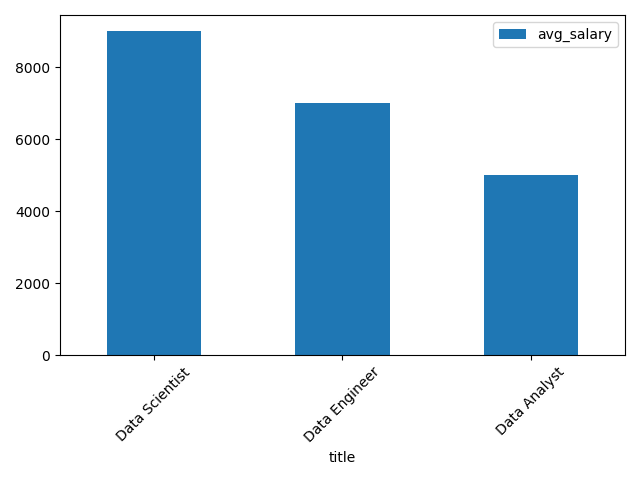

<<<<<<< HEAD
# 🚀 Job Data Engineering Project


---

# 📌 Project Evolution

## 🥇 Version 1
API + SQL (base técnica)

## 🥈 Version 2
Data Warehouse + Star Schema

## 🥉 Version 3
Automation + Historical Pipeline

## 🏆 Version 4
AWS + Docker + Airflow

---

# 📌 Overview

This project simulates a real-world Data Engineering pipeline using Python and SQL.

The pipeline extracts job market data from a public API, transforms the data, stores it in a dimensional Data Warehouse model, and generates analytical insights.

---

# 🏗️ Architecture


---

# ⚙️ Technologies

- Python
- Pandas
- SQL
- SQLite
- Requests
=======
# 🚀 Job Market Insights  
### Pipeline de Dados com API Pública, Python e SQL-Projeto 01


Projeto de engenharia/análise de dados que consome uma API pública de vagas de emprego, realiza tratamento com Python e disponibiliza análises utilizando SQL.

---

## 🧠 Objetivo

Demonstrar na prática a construção de um pipeline de dados completo:

- Extração de dados via API
- Transformação e limpeza com Python
- Armazenamento em banco SQL
- Análise de dados com queries

---


---

## 🔄 Pipeline de Dados

1. **Extração**
   - Consumo da API de vagas (Adzuna)
   - Requisições HTTP com `requests`

2. **Transformação**
   - Limpeza de dados
   - Tratamento de valores nulos
   - Padronização de colunas

3. **Carga**
   - Armazenamento em banco SQLite
   - Criação de tabela `jobs`

  

4. **Análise**
   - Consultas SQL para geração de insights


---

## 🛠️ Tecnologias Utilizadas

- Python
- Pandas
- Requests
- SQLite
- SQL
>>>>>>> b31aa07322384ae7c6ea93bf711cbcdd70e3f01e
- Matplotlib

---

<<<<<<< HEAD
# 📂 Project Structure


---

# 🔄 Pipeline Flow

```text
API → RAW → TRANSFORM → DATA WAREHOUSE → SQL ANALYTICS
```

---

# 🧱 Data Warehouse Model

### Fact Table
- fact_jobs

### Dimension Tables
- dim_company
- dim_location
- dim_job

---

# 📊 SQL Analytics

```sql
SELECT d.title, AVG(f.salary_min) as avg_salary
FROM fact_jobs f
JOIN dim_job d ON f.job_id = d.job_id
GROUP BY d.title;
```

---

# 🖼️ Query Example


---

# 📈 Salary Analysis



---

# 💾 Database Example


---

# 🚀 Features

✔️ ETL Pipeline  
✔️ API Data Extraction  
✔️ Data Transformation  
✔️ Data Warehouse Modeling  
✔️ SQL Analytics  
✔️ Data Visualization  

---

# ▶️ Run Project

```bash
python main.py
```

---

# 📌 Future Improvements

- Pipeline automation
- Historical data tracking
- Docker
- Apache Airflow
- AWS Cloud

---

# 👨‍💻 Author

Reginaldo Rocha
=======
## 📁 Estrutura do Projeto
```
job-data-project/
│
├── data/
│ ├── raw_jobs.json
│ ├── clean_jobs.csv
│
├── scripts/
│ ├── extract.py
│ ├── transform.py
│ ├── load.py
│ ├── analysis.py
│
├── assets/
│ └── fluxo.png
│
├── jobs.db
├── queries.sql
└── README.md
```
📈 Resultados

O projeto permite identificar:
```
Tendências salariais por cargo
Empresas com maior volume de contratações
Distribuição geográfica das vagas
Insights estratégicos sobre o mercado de trabalho
```

🔥 Diferenciais
```
Pipeline completo (API → Python → SQL)
Dados reais (não estáticos)
Organização profissional de projeto
Aplicação prática para análise de mercado
```

👨‍💻 Autor

Projeto desenvolvido por Reginaldo Rocha
>>>>>>> b31aa07322384ae7c6ea93bf711cbcdd70e3f01e
